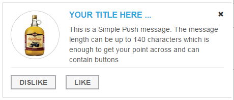
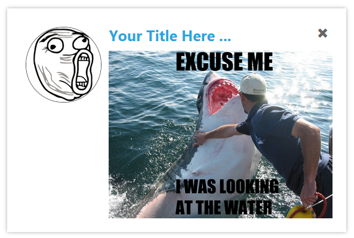
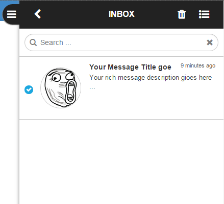

<p align="center" >
  
</p>

# DonkySDK-JS-Modular

The modular SDK exposes all of the network functionality in a way that means developers can consume only the pieces they need in order to:
<ul>
<li>Send custom notifications</li>
<li>Use Donky's messaging features</li>
<li>Automate actions and messaging</li>
<li>Track in app analytics</li>
<li>Build complex M2M, A2P and P2P applications</li>
</ul>

Using Donky as a data network allows developers to focus on writing the apps code rather than having to worry about building a reliable and secure network. The complexities of transferring data across the internet are taken care of, allowing developers to just build their application.

## Requirements

| Browser       		| Minimum version|
|:------------- 		|----------------:|
| IE      				| 10	|
| Firefox     		 	| 19    |
| Chrome 				| 13    |
| Safari 				| 6     |
| Opera 				| 12.1  |
| iOS Safari 			| 6.1   |
| Android Browser 		| 4.4   |
| Opera Mobile 			| 12    |
| Chrome for Andriod 	| 42    |
| Firefox for Android 	| 38    |
| IE Mobile 			| 10    |


## Author

Donky Networks Ltd, sdk@mobiledonky.com

## License

Donky-Core-SDK is available under the MIT license. See the LICENSE file for more info.

## Donky Core SDK

<ul>
<li>Donky Core SDK (Requried for all implementations of the Donky SDK.</li>
</ul>

## Modules

<ul>
<li>Simple Push Module (Logic + UI)</li>
<li>Rich Messaging Module (Logic + Pop-Up + Inbox)</li>
<li>Common Messaging Module (Logic + UI)</li>
<li>Core Analytics Module</li>
<li>Automation Module</li>
</ul>

## Third Party Dependencies

* [jQuery](https://jquery.com/)
* [signalR](http://signalr.net/)
* [Moustache](https://mustache.github.io/) (for UI modules)
* [Require.js](http://requirejs.org/) (Recommended for dependency management but not mandatory)


# Getting Started

### Prerequisite dependencies
The following scripts need to be included as prerequisites before you can use this SDK.
It will be assumed in all subsequent samples that this has been included 

```html
<!-- 
    Include jQuery and signalR.
    signalR is our websocket wrapper for realtime bidirectional communication 
    and it in turn has a dependency on jQuery. You can use any version of jQuery you like as long 
    the version number is >=  1.7
-->
<script src="https://cdnjs.cloudflare.com/ajax/libs/jquery/1.8.2/jquery.min.js"></script>
<script src="https://cdn.dnky.co/sdk/latest-modular/dependencies/jquery.signalR-2.2.0.min.js"></script>
         
<!-- 
    Include Require.js - this will perform all the dependency management 
-->        
<script src="https://cdnjs.cloudflare.com/ajax/libs/require.js/2.1.17/require.min.js"></script>    

<!-- 
    Include Donky require.js config file.
    This contains all the mappings of objects to scripts  
-->
<script src="https://cdn.dnky.co/sdk/latest-modular/modules/require-config.js"></script>
```


We host all our releases on a cdn so you can simply reference that. You can reference a specific version or the latest version. 
For a named version do the following: 

* Identify which release you want to use by browsing the [releases](https://github.com/Donky-Network/DonkySDK-JS-Modular/releases) section in Github
* reference the release in the following manner - for example if you wish to use the 2.2.0.0 release:
```html
<script src="https://cdn.dnky.co/sdk/2.2.0.0/modules/require-config.js"></script>
```
* If you just wish to use the latest (bearing in mind that this will periodically change) do this:
```html
<script src="https://cdn.dnky.co/sdk/latest-modular/modules/require-config.js"></script>
```


 

If you would like to fork and host yourself, see the [Grunt](#grunt) section. 


# Donky-Core-SDK

This provides the basics of any Donkyintegration into your apps.  The Core SDK is responsible for handling:

<ul>
    <li>Registration onto the Donky Network</li>
    <li>Communicating with the Donky Network</li>
    <li>Control of User and Device registration details</li>
    <li>Sending and receiving content</li>
</ul>


# DonkyCore interfaces
DonkyCore is a composite interface that contains functionality broken down into functional areas described below:

| Interface       		                                            | Example Usage| Description |
|:------------- 		                                            |:------       |:------------|
| [DonkyCore](http://cdn.dnky.co/sdk/latest-modular/jsdoc/DonkyCore.html) | donkyCore.initialise(...);  | DonkyCore object  |
| [DonkyData](http://cdn.dnky.co/sdk/latest-modular/jsdoc/DonkyData.html) | donkyCore.donkyData,get(...);  | interface to provide data access  |
| [DonkyAccount](http://cdn.dnky.co/sdk/latest-modular/jsdoc/DonkyAccount.html) | donkyCore.donkyAccount.getTags(...);  | interface to provide account related functionality  |
| [DonkyNetwork](http://cdn.dnky.co/sdk/latest-modular/jsdoc/DonkyNetwork.html) | donkyCore.donkyNetwork.synchronise(...);  | interface to  provide network access related functionality  |
| [DonkyLogging](http://cdn.dnky.co/sdk/latest-modular/jsdoc/DonkyLogging.html) | donkyCore.donkyLogging.clearLog();  | interface to provide logging functionality  |


# Directory Structure
The Donky SDK is packaged into the following directory structure. 
The messaging modules have been split into logic and UI components. 
This allows an integrator to potentially write their own UI from scratch if they have any special requirements. 

```
│
├───css
├───dependencies
├───images
├───modules
│   ├───automation
│   ├───core
│   ├───coreAnalytics
│   └───messaging
│       ├───common
│       │   ├───logic
│       │   └───ui
│       ├───rich
│       │   ├───logic
│       │   └───ui
│       └───simplePush
│           ├───logic
│           └───ui
├───samples
├───templates
└───tests
```


# Samples

Please note: donkyCore is only to be initialised ONCE. If you require a mixture of the below samples, 
you will need to merge the functionality together. If you are not familiar with [Require.js](http://requirejs.org/) 
then I suggest you head over to their site. Essentially you specify all the donky interfaces you want to use as an 
array of strings and they get passed to you asynchronously in the specified callback function. You just need to map the callback function arguments.
Internally, all associated dependencies with the interfaces you pick are resolved for you. 


| Sample       		| Description|
|:------------- 		|----------------:|
| [Initialise anonymously](#initialise-anonymously)  | Initialize anonymously 	|
| [Initialise as known user](#initialise-known-user)  | Initialize as a known user 	|
| [Send content](#send-content)  | Send a custom message to a known user 	|
| [Receive content](#receive-content)  | Receive a custom message  	|
| [Automation](#automation)  | Execute a third party trigger 	|
| [Simple push](#simple-push)  | Receive and display a simple push message 	|
| [Rich popup](#rich-popup)  | Receive a rich message and display it in a popup 	|
| [Rich inbox](#rich-inbox)  | Receive a rich message and display it in an inbox 	|
| [Rich inbox, Simple push with audio](##rich-inbox--simple-push)  | Receive a rich message and display it in an inbox and play a sound 	|

## Initialise anonymously
This example initialises Donky anonymously. 
```javascript
// We ask Require.js for the donkyCore interface
require(['donkyCore'],function(donkyCore) {
    donkyCore.initialise({
        apiKey: ">>>Enter API Key here<<<",
        resultHandler: function(result) {
            if(result.succeeded) {
                var registrationDetails = donkyCore.donkyAccount.getRegistrationDetails();
                console.log(JSON.stringify(registrationDetails));
            }else{
                console.log(JSON.stringify(result));
			}
        }
    });
});
```
To read more about Donky Modular SDK go [here](http://docs.mobiledonky.com/docs/js-setup).

JS Specific API docs for [initialize()](http://cdn.dnky.co/sdk/latest-modular/jsdoc/DonkyCore.html#initialise). 


## Initialise (known user)
This example initialises Donky with a known user.
```javascript
require(['donkyCore'],function(donkyCore) {
    donkyCore.initialise({
        apiKey: ">>>Enter API Key here<<<",
        userDetails: {
            id: "johnsmith",
            displayName: "John Smith",
            firstName: "John",
            lastName: "Smith",
            emailAddress: "john.smith@hotmail.co.uk",
            countryCode: "GBR",
            phoneNumber: "07979497000",            
        },
        resultHandler: function(result) {
            if(result.succeeded) {
                var registrationDetails=donkyCore.donkyAccount.getRegistrationDetails();
                console.log(JSON.stringify(registrationDetails));
            }else{
                console.log(JSON.stringify(result));
			}
        }
    });
});
```


## Send Content
In this example we will send some custom content to another user.
```javascript
require(['donkyCore'],function(donkyCore) {
    donkyCore.initialise({
        apiKey: ">>>Enter API Key here<<<",
        resultHandler: function(result) {
            if(result.succeeded) {
                // Create an object containing what I want to send
                var myCustomData = {
                    message: "Hello World",
                    messageTimeStamp: new Date().toISOString()
                }; 
                
                var notification = donkyCore.createContentNotificationForSpecifiedUsers(
                    // Send message to the following users
                    ["johnsmith", "johndoe"],
                    // givethe notification a type 
                    "myCustomNotification", 
                    // specify the actual data
                    myCustomData
                );
                // send the notification
                donkyCore.sendContentNotifications(notification, function (){
                    // callback fires after message has been sent
                    console.("content sent ;-)");
                });                

            }else{
                console.log(JSON.stringify(result));
			}
        }
    });
});

```
JS Specific API docs for [sendContentNotifications()](http://cdn.dnky.co/sdk/latest-modular/jsdoc/DonkyCore.html#sendContentNotifications). 

## Receive Content

In this example we will receive the custom content sent in the previous example. To test this out you can actually send messages to yourself.
```javascript
// Here is how to get the current user after initialisation
var registrationDetails = donkyCore.donkyAccount.getRegistrationDetails();
consloe.log("current userId: " + registrationDetails.userDetails.id);
```
Initialize donky core as John Smith (in a different browser) ... See [Notes](#notes)  

```javascript
require(['donkyCore'],function(donkyCore) {
        
    // setup a Content Notification subscription ...
    donkyCore.subscribeToContentNotifications({
        // need to create a module definition for the handler
            name: "demoApp",
            version: "1.0.0.0",
        },
        {
            // Specify what notification we are interested in
            notificationType: "myCustomNotification",
            // Callback handler to process the notification
            handler: function(notification) {
                // the object 'myCustomData' passed in in the previous sample is available in the notification.data.customData property 
                console.log("myCustomNotification: " + JSON.stringify(notification.data.customData));
            }
        });
    
    donkyCore.initialise({
        apiKey: ">>>Enter API Key here<<<",
        userDetails: {
            id: "johnsmith",
            displayName: "John Smith",
            firstName: "John",
            lastName: "Smith",
            emailAddress: "john.smith@hotmail.co.uk",
            countryCode: "GBR",
            phoneNumber: "07979497000",            
        },
        resultHandler: function(result) {
            if(result.succeeded) {
                // Continue on with your app ....
            }else{
                console.log(JSON.stringify(result));
			}
        }
    });
});
```
JS Specific API docs for [subscribeToContentNotifications()](http://cdn.dnky.co/sdk/latest-modular/jsdoc/DonkyCore.html#subscribeToContentNotifications). 

## Automation
A third party trigger is a mechanism to trigger a compaign when an application specific event has occured.
For the porpose of this sample I will simply execute after initialisation. In the real world some application 
state or event will be used to decide when to execute. Also note that I have included donkyPushUI in this code snippet.
Typically the resulting action of the third party trigger will be to send a message to the user. 
This sample assumes it will be a push message.

```javascript
// We ask Require.js for the donkyAutomation interface along with donkyCore   
require(['donkyCore', 'donkyAutomation', 'donkyPushUI'],function(donkyCore, donkyAutomation, donkyPushUI) {
    donkyCore.initialise({
        apiKey: ">>>Enter API Key here<<<",
        resultHandler: function(result) {
            if(result.succeeded) {
                                                
                donkyPushUI.initialise();      
                
                /* We can pass in some custom data with the trigger.
                 * This can be used as merge fields for the resulting message
                 */ 
                var myCustomData = {
                    param1: "hello",
                    param2: "world"    
                };
                
                // the first argument is the trigger Key which Donky uses to identify which trigger to execute.
                donkyAutomation.executeThirdPartyTrigger("myKey", myCustomData );
            }else{
                console.log(JSON.stringify(result));
			}
        }
    });
});
```
JS Specific API docs for [executeThirdPartyTrigger()](http://cdn.dnky.co/sdk/latest-modular/jsdoc/DonkyAutomation.html#executeThirdPartyTrigger). 

## Simple Push
You can receive simple push messages in the Javascript SDK and they will be displayed in a popup as in the sample image below. 
You can customise the look and position of this popup. If you want to do this then visit the documentation [here](http://docs.mobiledonky.com/docs/js-simple-push)



Here is some sample code showing how to initialise Donky to receive simple push messages.

```javascript
require(['donkyPushUI','donkyCore', 'donkyCoreAnalytics'],function(donkyPushUI,donkyCore, donkyCoreAnalytics) {

    donkyCore.initialise({
        apiKey: ">>>YOUR API KEY HERE<<<",
        resultHandler: function(result) {
            if(result.succeeded) {
                donkyPushUI.initialise();				
            }
        }
    });
});
```
Internally, donkyPushUI uses the donkyPushLogic module. If you wish to build your own UI, you can just use donkyPushLogic to access the push messages.
JS Specific API docs for [donkyPushUI](http://cdn.dnky.co/sdk/latest-modular/jsdoc/DonkyPushUI.html) and 
[donkyPushLogic](http://cdn.dnky.co/sdk/latest-modular/jsdoc/DonkyPushLogic.html)


## Rich Popup
You can receive rich messages in the Javascript SDK and they can be displayed in a popup as in the sample image below. 
You can customise the look and position of this popup. If you want to do this then visit the documentation [here](http://docs.mobiledonky.com/docs/js-rich-popup)
Note: Rich messages can also be delivered into an inbox. See the next example for details.



Here is some sample code showing how to initialise Donky to receive rich messages and display them in in a popup.

```javascript
require(['donkyRichPopupUI','donkyCore', 'donkyCoreAnalytics'],function(donkyRichPopupUI,donkyCore, donkyCoreAnalytics) {

    donkyCore.initialise({
        apiKey: ">>>YOUR API KEY HERE<<<",
        resultHandler: function(result) {
            if(result.succeeded) {
                donkyRichPopupUI.initialise();				
            }
        }
    });
});

```
Internally, donkyRichPopupUI uses the donkyRichLogic module. If you wish to build your own UI, you can just use donkyRichLogic to access the rich messages.
JS Specific API docs for [donkyRichPopupUI](http://cdn.dnky.co/sdk/latest-modular/jsdoc/DonkyRichPopupUI.html) and
[donkyRichLogic](http://cdn.dnky.co/sdk/latest-modular/jsdoc/DonkyRichLogic.html)

## Rich Inbox
You can receive rich messages in the Javascript SDK and they can be displayed in an inboxp as in the sample image below. 
You can customise the look of this inbox. If you want to do this then visit the documentation [here](http://docs.mobiledonky.com/v1.3/docs/rich-messaging)



Here is some sample code showing how to initialise Donky to receive rich messages and display them in in an inbox.

```javascript
// We ask Require.js for all the interfaces we require
require(['donkyRichInboxUI', 'donkyInboxContainerUI', 'donkyCore', 'donkyCoreAnalytics'],
    function(donkyRichInboxUI, donkyInboxContainerUI, donkyCore, donkyCoreAnalytics) {
    // Initialise Donky (anonymously)
    // We create donkyCoreAnalytics to provide some data, you don't need to do anything, just instanciate it.
    donkyCore.initialise({
        apiKey: ">>>Enter API Key here<<<",
        resultHandler: function(result) {
            if(result.succeeded) {
                // Initialise the donkyRichInboxUI module
                donkyRichInboxUI.initialise();                
                // Initialise the donkyInboxContainerUI module - note that we pass in the donkyRichInboxUI module in an array.
                donkyInboxContainerUI.initialise([donkyRichInboxUI]);				
            }
        }
    });    
});
```
Internally, donkyRichInboxUI uses the donkyRichLogic module. If you wish to build your own UI, you can just use donkyRichLogic to access the rich messages.
JS Specific API docs for [donkyRichInboxUI](http://cdn.dnky.co/sdk/latest-modular/jsdoc/DonkyRichInboxUI.html),
[donkyRichLogic](http://cdn.dnky.co/sdk/latest-modular/jsdoc/DonkyRichLogic.html),
and [donkyInboxContainerUI](http://cdn.dnky.co/sdk/latest-modular/jsdoc/DonkyInboxContainerUI.html).


## Rich Inbox, Simple Push and Audio 
   
You can also easily combine Push and Rich message functionality in the same app. 
If you want to have a sound played when a message is received, this can also be done with the donkyAudio interface.
A soundfile can be configured against a particular message type. Notice the usage of the enum "messageTypes" in donkyMessagingCommon.
This is implemented using HTML5 Audio: regarding supported file formats, this is down to the browser the client is using. See [this wikipedia](https://en.wikipedia.org/wiki/HTML5_Audio) 
article for a list of supported audio formats for all the common browsers. 
 
   
```javascript
require(['donkyRichInboxUI', 'donkyInboxContainerUI', 'donkyPushUI', 'donkyCore', 'donkyCoreAnalytics', 'donkyMessagingCommon', 'donkyAudio'],
    function(donkyRichInboxUI, donkyInboxContainerUI, donkyPushUI, donkyCore, donkyCoreAnalytics, donkyMessagingCommon, donkyAudio) {

    // Configure audio files - we can assign different files to different message types. 
    donkyAudio.setSound(donkyMessagingCommon.messageTypes.simplePush, donkyCore.installDir + "audio/donkey.wav");
    donkyAudio.setSound(donkyMessagingCommon.messageTypes.rich, donkyCore.installDir + "audio/Pling.mp3");
        
    // Initialise Donky (anonymously)
    // We create donkyCoreAnalytics to provide some data, you don't need to do anything, just instanciate it.
    donkyCore.initialise({
        apiKey: ">>>Enter API Key here<<<",
        resultHandler: function(result) {
            if(result.succeeded) {
                // Initialise the donkyPushUI module 
                donkyPushUI.initialise();
                // Initialise the donkyRichInboxUI module
                donkyRichInboxUI.initialise();                
                // Initialise the donkyInboxContainerUI module - note that we pass in the donkyRichInboxUI module in an array.
                donkyInboxContainerUI.initialise([donkyRichInboxUI]);				
            }
        }
    });    
});
```
Documentation for donkyAudio here[here](http://cdn.dnky.co/sdk/latest-modular/jsdoc/DonkyAudio.html)

## Embedding Inbox into an iframe on your page

If you want to embed rich inbox into a div within your site rather than have the dock to the right, slide to open/close functionality you can do this with the donkyInboxEmbedUI plugin.
The plugin expects an iframe with an id of "donkyInboxUIContainer" (this can be overriden). You can wrap it in a div to allow better positioning.
Here is an html snippet with some style to place the iframe in an overlay:  
```html
<style>
    #inbox-container{
        position: fixed;
        top: 10%;
        bottom: 10%;
        right: 10%;
        left: 10%;
        z-index: 100;
    }
</style>

<div id="inbox-container">
</div>      
```

The following script will initialise everything for you (anonymous registration)

```javascript
require(['donkyRichInboxUI','donkyInboxEmbedUI', 'donkyCore', 'donkyCoreAnalytics'],
    function(donkyRichInboxUI, donkyInboxEmbedUI, donkyCore, donkyCoreAnalytics) {
    // Initialise Donky (anonymously)
    donkyCore.initialise({
        apiKey: ">>>YOUR API KEY<<<",
        resultHandler: function(result) {
            if(result.succeeded) {
                // Initialise the donkyRichInboxUI module
                donkyRichInboxUI.initialise();                
                var options = {
                    // This is the div that we will insert the inbox into
                    iFrameContainer: "donky-inbox",                    
                    // we only have 1 view so don't show the index page   
                    showIndexPage: false 
                };                    
                // Initialise the donkyInboxEmbedUI module
                donkyInboxEmbedUI.initialise([donkyRichInboxUI], options);						                        
            }
        }
    });
});
```

# Grunt
To build the release yourself and host yourself follow these steps:

Install [node.js](https://nodejs.org/) if you don't have it already.
 
Then open a console in the root folder and install all the build dependencies.

```shell
    npm install
```

Then you can build a "release" with [grunt](http://gruntjs.com/). (Install if required) 

```shell
    grunt --sdkVersion={{version}} --urlBase={{url}}
    
    i.e.
    
    grunt --sdkVersion=2.0.0.2 --urlBase=https://your.domain/com/donkySdk/
```

There are 2 command line options which are required (will default to the above). 
They are used to form a path for the output folder which will be build/2.0.0.2 in this example
Some UI plugins also need to know the location of various resources which will be based on the URL base and the version number:
You would have the SDK deployed such that it could be accessed by the following URL 

https://your.domain/com/donkySdk/2.0.0.2


#### --sdkVersion
This is the version number to use - some relative URL's will be built with this
#### --urlBase
This is the location you will host your build


Documentation will be also generated by the build and will be in a subfolder build/2.0.0.2/JSDoc


# Notes
## Usage of Local Storage
All data is persisted in browser [local storage](http://diveintohtml5.info/storage.html). 
This means that if you fire up more than one browser tab for a given domain, they will share the same storage and 
will each receive the same notifications. This is not a recommended use case although it will work.    


